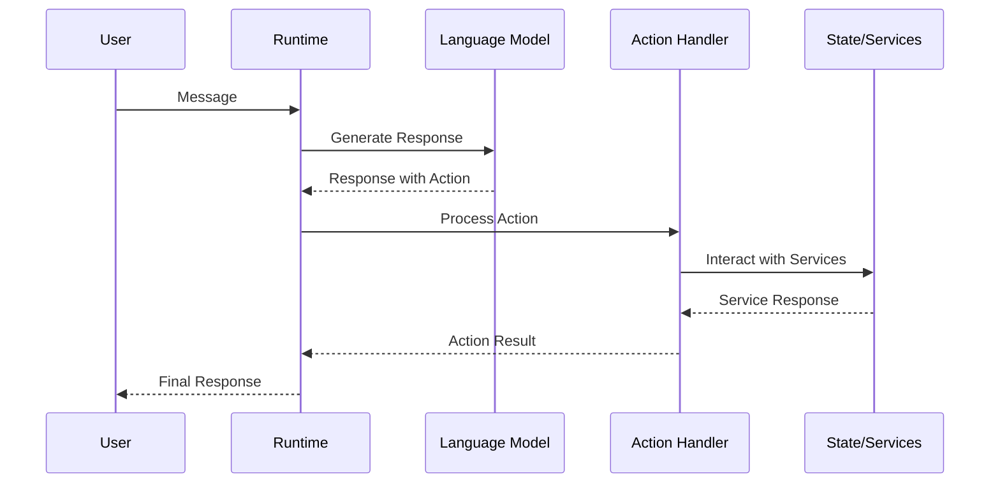
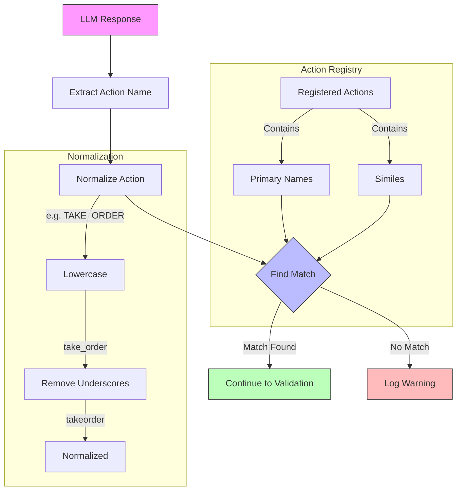

# Action Runtime Operation

## Disclaimer
This document was AI-generated by Cascade on 2025-01-02, based on analysis of the Eliza agent core source code from v.01.6-alpha5. While efforts have been made to ensure accuracy, this documentation may contain inaccuracies. Please use with discretion and refer to the original source code for definitive implementation details.

## Overview

Actions are core building blocks in Eliza that define how agents respond to and interact with messages. Unlike providers (which supply context) or evaluators (which validate responses), actions are the mechanisms through which agents actually effect change in their environment. They allow agents to:

1. Interact with external systems
2. Modify their behavior
3. Perform tasks beyond simple message responses
4. Control conversation flow
5. Integrate with external services

## Action Architecture



## Action Interface

```typescript
interface Action {
    /** Unique identifier for the action */
    name: string;

    /** Alternative names/variations that can trigger this action */
    similes: string[];

    /** Detailed explanation of when and how to use this action */
    description: string;

    /** Example usage patterns */
    examples: ActionExample[][];

    /** Implementation of the action's behavior */
    handler: Handler;

    /** Function that checks if action is appropriate */
    validate: Validator;
}

interface ActionExample {
    /** User associated with the example */
    user: string;

    /** Content of the example */
    content: Content;
}
```

## Built-in Actions

### 1. Conversation Flow

#### CONTINUE
```typescript
const continueAction: Action = {
    name: "CONTINUE",
    similes: ["ELABORATE", "KEEP_TALKING"],
    description: "Used when the message requires a follow-up. Limited to 3 consecutive continues.",
    validate: async (runtime, message) => {
        const continueCount = await getContinueCount(runtime, message);
        return continueCount < 3;
    },
    handler: async (runtime, message, state) => {
        await incrementContinueCount(runtime, message);
        // Continue conversation logic
    }
};
```

#### IGNORE
```typescript
const ignoreAction: Action = {
    name: "IGNORE",
    similes: ["STOP_TALKING", "STOP_CHATTING"],
    description: "Used for graceful conversation disengagement",
    handler: async (runtime, message) => {
        // Mark conversation as complete
        await runtime.messageManager.saveMemory({
            type: "conversation_state",
            content: { status: "completed" }
        });
    }
};
```

### 2. External Integrations

#### TAKE_ORDER
```typescript
const takeOrder: Action = {
    name: "TAKE_ORDER",
    similes: ["BUY_ORDER", "PLACE_ORDER"],
    description: "Records trading/purchase orders with conviction levels",
    validate: async (runtime, message) => {
        const text = message.content.text;
        // Validate ticker symbols
        const tickerRegex = /\b[A-Z]{1,5}\b/g;
        if (!tickerRegex.test(text)) {
            return {
                pass: false,
                reason: "No valid ticker symbol found"
            };
        }
        // Check user permissions
        const hasPermission = await checkTradePermission(runtime, message);
        return {
            pass: hasPermission,
            reason: hasPermission ? "Valid" : "Insufficient permissions"
        };
    },
    handler: async (runtime, message, state) => {
        const order = extractOrderDetails(message);
        await runtime.getService(ServiceType.TRADING).placeOrder(order);
    }
};
```

## Action Lifecycle

### 1. Registration
```typescript
// In plugin definition
const myPlugin: Plugin = {
    name: "my-plugin",
    actions: [myAction],
    // ...other plugin properties
};

// Runtime registration
runtime.registerAction(action);
```

### 2. Validation
```typescript
const action: Action = {
    validate: async (runtime, message, state) => {
        try {
            // 1. Check prerequisites
            if (!state?.userId) {
                return {
                    pass: false,
                    reason: "User ID required"
                };
            }

            // 2. Verify permissions
            const canExecute = await checkPermissions(runtime, state.userId);
            if (!canExecute) {
                return {
                    pass: false,
                    reason: "Insufficient permissions"
                };
            }

            // 3. Validate parameters
            const params = extractParams(message);
            const isValid = validateParams(params);

            return {
                pass: isValid,
                reason: isValid ? "Valid" : "Invalid parameters"
            };
        } catch (error) {
            return {
                pass: false,
                reason: `Validation error: ${error.message}`
            };
        }
    }
};
```

### 3. Execution
```typescript
const action: Action = {
    handler: async (runtime, message, state) => {
        try {
            // 1. Extract parameters
            const params = extractParams(message);

            // 2. Get required services
            const service = runtime.getService(ServiceType.DATABASE);

            // 3. Execute operation
            const result = await service.operation(params);

            // 4. Update state if needed
            await updateState(runtime, result);

            // 5. Return result
            return {
                success: true,
                data: result
            };
        } catch (error) {
            runtime.logger.error("Action failed", {
                action: this.name,
                error: error.message
            });
            return {
                success: false,
                error: error.message
            };
        }
    }
};
```

## Action Triggering

Actions are triggered through a multi-step process:

### 1. LLM Response
The Language Model generates a response that includes an action name in its output. This can be either:
- The primary action name (e.g., "TAKE_ORDER")
- One of its similes (e.g., "BUY_ORDER", "PLACE_ORDER")

### 2. Action Resolution
```typescript
async processActions(
    message: Memory,
    responses: Memory[],
    state?: State
): Promise<void> {
    for (const response of responses) {
        // Extract and normalize action name
        const normalizedAction = response.content?.action
            .toLowerCase()
            .replace("_", "");

        // Find matching action (including similes)
        const action = this.actions.find(
            (a) => [a.name.toLowerCase(), ...a.similes.map(s => s.toLowerCase())]
                .includes(normalizedAction)
        );

        if (!action) {
            runtime.logger.warn(`Unknown action: ${normalizedAction}`);
            continue;
        }

        // Rest of processing...
    }
}
```

### 2. Action Resolution

The action resolution process matches the LLM's requested action with registered actions, including their similes. Action names are normalized to ensure consistent matching regardless of formatting:

1. **Normalization Rules**:
   - Convert to lowercase (e.g., "TAKE_ORDER" → "take_order")
   - Remove underscores (e.g., "take_order" → "takeorder")
   - Trim whitespace
   - Special characters are not allowed in action names

2. **Matching Process**:
   - The normalized action name is compared against:
     - The normalized primary action name
     - All normalized similes
   - First matching action is selected
   - Case-insensitive matching ensures flexibility



```typescript
async processActions(
    message: Memory,
    responses: Memory[],
    state?: State
): Promise<void> {
    for (const response of responses) {
        // Extract and normalize action name
        const normalizedAction = response.content?.action
            .toLowerCase()
            .replace("_", "");

        // Find matching action (including similes)
        const action = this.actions.find(
            (a) => [a.name.toLowerCase(), ...a.similes.map(s => s.toLowerCase())]
                .includes(normalizedAction)
        );

        if (!action) {
            runtime.logger.warn(`Unknown action: ${normalizedAction}`);
            continue;
        }

        // Rest of processing...
    }
}
```

The diagram shows how:
1. Action names are extracted from LLM responses
2. Names are normalized through lowercase and underscore removal
3. The normalized name is matched against both primary names and similes
4. Successful matches proceed to validation, while failures are logged

### 3. Validation Phase
Before an action is executed, its validation function is called:
```typescript
const validation = await action.validate(runtime, message, state);
if (!validation.pass) {
    runtime.logger.warn(`Action validation failed: ${validation.reason}`);
    continue;
}
```

The validation function can check:
- Required parameters
- User permissions
- System state
- External conditions

### 4. Execution Phase
If validation passes, the action's handler is executed:
```typescript
try {
    await action.handler(runtime, message, state);
} catch (error) {
    runtime.logger.error("Action execution failed", {
        action: action.name,
        error: error.message
    });
}
```

### Special Cases

1. **Multiple Actions**
   - Multiple actions can be triggered in sequence
   - Each action is processed independently
   - Failure of one action doesn't prevent others

2. **Default Actions**
   - NONE: Used for standard responses
   - CONTINUE: For maintaining conversation flow
   - IGNORE: For graceful disengagement

3. **Action Chaining**
   - Actions can trigger other actions
   - Must avoid circular dependencies
   - Should implement proper rollback

4. **Error Handling**
   - Failed validation skips the action
   - Runtime errors are logged
   - State is maintained for retry

## Runtime Processing

### Action Selection and Execution
```typescript
async processActions(
    message: Memory,
    responses: Memory[],
    state?: State,
    callback?: HandlerCallback
): Promise<void> {
    for (const response of responses) {
        if (!response.content?.action) {
            runtime.logger.warn("No action found in response");
            continue;
        }

        // 1. Normalize action name
        const normalizedAction = response.content.action
            .toLowerCase()
            .replace("_", "");

        // 2. Find matching action (including similes)
        const action = this.actions.find(
            (a) => [a.name.toLowerCase(), ...a.similes.map(s => s.toLowerCase())]
                .includes(normalizedAction)
        );

        if (!action) {
            runtime.logger.warn(`Unknown action: ${normalizedAction}`);
            continue;
        }

        // 3. Validate action
        const validation = await action.validate(this, message, state);
        if (!validation.pass) {
            runtime.logger.warn(`Action validation failed: ${validation.reason}`);
            continue;
        }

        // 4. Execute action
        try {
            await action.handler(this, message, state);
        } catch (error) {
            runtime.logger.error("Action execution failed", {
                action: action.name,
                error: error.message
            });
            if (callback) {
                await callback(error);
            }
        }
    }
}
```

## Best Practices

### 1. Action Design
- Keep actions atomic and focused
- Use clear, descriptive names
- Provide comprehensive examples
- Include similar action references
- Document side effects

### 2. Error Handling
```typescript
const reliableAction: Action = {
    handler: async (runtime, message, state) => {
        const transaction = await runtime.database.startTransaction();

        try {
            // Main operation
            const result = await performOperation();

            // Commit changes
            await transaction.commit();

            return { success: true, data: result };
        } catch (error) {
            // Rollback on error
            await transaction.rollback();

            // Log error
            runtime.logger.error("Action failed", {
                action: this.name,
                error: error.message
            });

            // Return meaningful error
            return {
                success: false,
                error: "Operation failed",
                details: error.message
            };
        }
    }
};
```

### 3. State Management
```typescript
const statefulAction: Action = {
    handler: async (runtime, message, state) => {
        // 1. Read state
        const currentState = state?.operationState || {};

        // 2. Perform operation
        const result = await performOperation(currentState);

        // 3. Update state atomically
        await runtime.messageManager.saveMemory({
            type: "operation_state",
            content: {
                ...currentState,
                lastOperation: result,
                timestamp: Date.now()
            }
        });

        // 4. Update runtime state
        Object.assign(state, {
            operationState: {
                ...currentState,
                lastOperation: result
            }
        });

        return { success: true };
    }
};
```

## Common Patterns

### 1. Service Integration
```typescript
const serviceAction: Action = {
    handler: async (runtime, message, state) => {
        // Get required services
        const database = runtime.getService(ServiceType.DATABASE);
        const cache = runtime.getService(ServiceType.CACHE);

        // Check cache first
        const cacheKey = generateCacheKey(message);
        const cached = await cache.get(cacheKey);
        if (cached) return cached;

        // Perform database operation
        const result = await database.query(params);

        // Cache result with TTL
        await cache.set(cacheKey, result, {
            ttl: 60 * 60 // 1 hour
        });

        return result;
    }
};
```

### 2. Chained Actions
```typescript
const chainedAction: Action = {
    handler: async (runtime, message, state) => {
        // 1. First operation
        const result1 = await firstOperation();
        if (!result1.success) {
            return result1;
        }

        // 2. Use result in second operation
        const result2 = await secondOperation(result1.data);
        if (!result2.success) {
            // Rollback first operation if needed
            await rollbackFirstOperation(result1.data);
            return result2;
        }

        // 3. Final operation
        return finalOperation(result2.data);
    }
};
```

### 3. Progressive Enhancement
```typescript
const enhancedAction: Action = {
    handler: async (runtime, message, state) => {
        // 1. Basic operation
        const basicResult = await basicOperation();

        // 2. Try enhanced features if available
        if (runtime.hasService(ServiceType.ENHANCED)) {
            try {
                const enhancedResult = await enhancedOperation(basicResult);
                return {
                    ...enhancedResult,
                    enhanced: true
                };
            } catch {
                runtime.logger.warn("Enhanced operation failed, using basic result");
            }
        }

        // Fallback to basic result
        return {
            ...basicResult,
            enhanced: false
        };
    }
};
```

## Frequently Asked Questions

### Q: How do I debug action resolution failures?
A: Follow these steps:
1. Enable debug logging:
```typescript
runtime.logger.setLevel('debug');
```

2. Check the normalized action name:
```typescript
console.log('Normalized:', response.content?.action
    .toLowerCase()
    .replace("_", ""));
```

3. List registered actions and similes:
```typescript
console.log('Available actions:', runtime.actions
    .map(a => ({
        name: a.name,
        similes: a.similes
    })));
```

4. Verify validation logic:
```typescript
const validation = await action.validate(runtime, message, state);
console.log('Validation result:', validation);
```

### Q: What's the difference between similes and aliases?
A:
- **Similes** are alternative names that mean exactly the same thing (e.g., "TAKE_ORDER", "PLACE_ORDER")
- **Aliases** are shortcuts or variations that might have slightly different behavior
- Always use similes for exact matches and implement separate actions for different behaviors

### Q: How do I handle action timeouts?
A: Implement timeout handling in your action:
```typescript
const actionWithTimeout: Action = {
    handler: async (runtime, message, state) => {
        const timeout = 30000; // 30 seconds

        const timeoutPromise = new Promise((_, reject) => {
            setTimeout(() => reject(new Error('Action timeout')), timeout);
        });

        try {
            await Promise.race([
                yourOperation(),
                timeoutPromise
            ]);
        } catch (error) {
            if (error.message === 'Action timeout') {
                runtime.logger.warn('Action timed out');
                // Cleanup or recovery logic
            }
            throw error;
        }
    }
};
```

### Q: Can actions modify the LLM's response?
A: No, actions are executed after the LLM has generated its response. However, you can:
1. Use providers to influence future responses
2. Chain actions to handle response modifications
3. Use evaluators to validate responses before action execution

### Q: How do I handle action dependencies?
A: For actions that depend on other actions:

1. Use explicit dependencies:
```typescript
interface ActionWithDeps extends Action {
    dependencies: string[];
}

const dependentAction: ActionWithDeps = {
    name: "PROCESS_ORDER",
    dependencies: ["VALIDATE_USER", "CHECK_BALANCE"],
    handler: async (runtime, message, state) => {
        // Verify dependencies have run
        const deps = state?.actionResults || {};
        if (!deps.VALIDATE_USER || !deps.CHECK_BALANCE) {
            throw new Error('Required actions not executed');
        }
        // Continue processing
    }
};
```

2. Implement rollback capabilities:
```typescript
interface ActionWithRollback extends Action {
    rollback?: (runtime: IAgentRuntime, state: State) => Promise<void>;
}

const rollbackableAction: ActionWithRollback = {
    handler: async (runtime, message, state) => {
        try {
            await performOperation();
        } catch (error) {
            if (this.rollback) {
                await this.rollback(runtime, state);
            }
            throw error;
        }
    },
    rollback: async (runtime, state) => {
        // Cleanup logic
    }
};
```

### Q: How do I handle rate limiting in actions?
A: Implement rate limiting using the runtime cache:
```typescript
const rateLimitedAction: Action = {
    handler: async (runtime, message, state) => {
        const key = `rate_limit:${this.name}:${message.userId}`;
        const limit = 5; // requests
        const window = 60000; // 1 minute

        const current = await runtime.cache.get(key) || 0;
        if (current >= limit) {
            throw new Error('Rate limit exceeded');
        }

        await runtime.cache.set(key, current + 1, {
            ttl: window
        });

        // Continue with action
    }
};
```

### Q: How do I test action simile matching?
A: Create test cases for all simile variations:
```typescript
describe('Action Resolution', () => {
    const action = {
        name: 'TEST_ACTION',
        similes: ['DO_TEST', 'RUN_TEST']
    };

    test.each([
        'TEST_ACTION',
        'test_action',
        'DO_TEST',
        'do_test',
        'RUN_TEST',
        'run_test'
    ])('should match %s', async (actionName) => {
        const response = createResponse(actionName);
        const result = await runtime.processActions(message, [response]);
        expect(result).toBeTruthy();
    });
});
```

### Q: How do I handle concurrent action execution?
A: Use state locking and queuing:
```typescript
const concurrentAction: Action = {
    handler: async (runtime, message, state) => {
        const lockKey = `lock:${this.name}:${message.userId}`;

        if (await runtime.cache.get(lockKey)) {
            // Either queue the action or reject
            throw new Error('Action already in progress');
        }

        try {
            await runtime.cache.set(lockKey, true, { ttl: 30000 });
            await performOperation();
        } finally {
            await runtime.cache.del(lockKey);
        }
    }
};
```

### Q: How do I handle action errors?
A: Implement comprehensive error handling:
```typescript
const robustAction: Action = {
    handler: async (runtime, message, state) => {
        try {
            // 1. Pre-execution checks
            await this.preCheck(runtime, state);

            // 2. Main operation with retry
            const result = await retry(
                () => performOperation(),
                {
                    attempts: 3,
                    backoff: 'exponential'
                }
            );

            // 3. Post-execution cleanup
            await this.postProcess(runtime, result, state);

            return result;
        } catch (error) {
            // 4. Error classification
            if (error instanceof ValidationError) {
                runtime.logger.warn('Validation failed', error);
                throw error;
            }

            if (error instanceof SystemError) {
                runtime.logger.error('System error', error);
                await this.systemErrorRecovery(runtime, state);
                throw error;
            }

            // 5. Default error handling
            runtime.logger.error('Unexpected error', error);
            throw new ActionError(this.name, error.message);
        }
    }
};
```

### Q: Why are actions defined in ALLCAPS but matched case-insensitively?
A: Actions are defined in ALLCAPS (e.g., "TAKE_ORDER") for several reasons:
1. **Visual Distinction**: Makes actions stand out in code and documentation
2. **Convention**: Follows common practice for constant/enum values
3. **Developer Experience**: Easier to spot in logs and debugging

However, they are matched case-insensitively to:
1. **Improve Robustness**: Handles variations in LLM output formatting
2. **Reduce Errors**: Prevents matching failures due to case mismatches
3. **Flexibility**: Allows for natural language variations

### Q: How do I handle action state persistence?
A: Use the runtime's state management capabilities:
```typescript
const statefulAction: Action = {
    handler: async (runtime, message, state) => {
        // 1. Load persisted state
        const savedState = await runtime.messageManager.getMemory({
            type: "action_state",
            id: message.id
        });

        // 2. Update state
        const newState = {
            ...savedState,
            timestamp: Date.now(),
            updates: []
        };

        // 3. Persist state atomically
        await runtime.messageManager.saveMemory({
            type: "action_state",
            content: newState
        });

        // 4. Return updated state
        return newState;
    }
};
```

### Q: How do I implement action rollback on failure?
A: Use a transaction-like pattern:
```typescript
const rollbackableAction: Action = {
    async handler(runtime, message, state) {
        const changes = [];

        try {
            // 1. First operation
            const result1 = await operation1();
            changes.push({ op: 'operation1', data: result1 });

            // 2. Second operation
            const result2 = await operation2();
            changes.push({ op: 'operation2', data: result2 });

            return { success: true };
        } catch (error) {
            // Rollback in reverse order
            for (const change of changes.reverse()) {
                await this.rollbackOperation(change.op, change.data);
            }
            throw error;
        }
    }
};
```

### Q: How do I manage action timeouts and retries?
A: Implement a robust timeout and retry mechanism:
```typescript
const reliableAction: Action = {
    async handler(runtime, message, state) {
        const options = {
            timeout: 30000,    // 30 second timeout
            retries: 3,        // Maximum 3 retries
            backoff: {         // Exponential backoff
                initial: 1000,
                multiplier: 2,
                maxDelay: 10000
            }
        };

        let attempt = 0;
        while (attempt < options.retries) {
            try {
                const result = await Promise.race([
                    this.operation(),
                    new Promise((_, reject) =>
                        setTimeout(() => reject(new Error('Timeout')),
                        options.timeout)
                    )
                ]);
                return result;
            } catch (error) {
                attempt++;
                if (attempt === options.retries) throw error;

                const delay = Math.min(
                    options.backoff.initial * Math.pow(options.backoff.multiplier, attempt),
                    options.backoff.maxDelay
                );
                await new Promise(resolve => setTimeout(resolve, delay));
            }
        }
    }
};
```

_Note: This FAQ will be updated with new questions and answers as they arise from ongoing development and user feedback._
