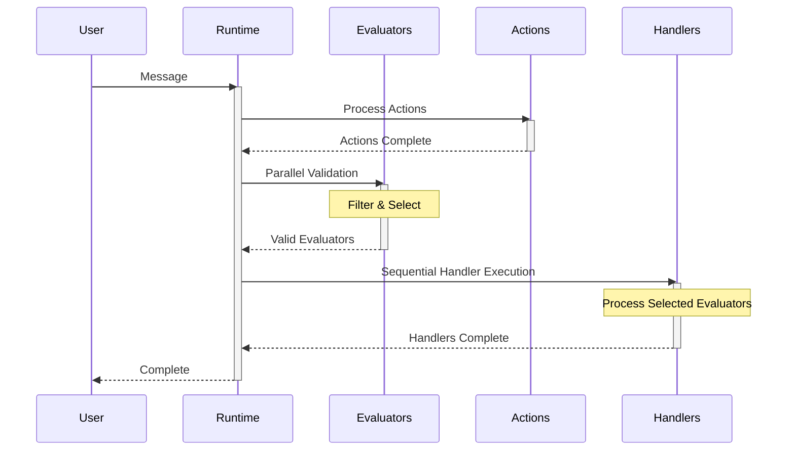
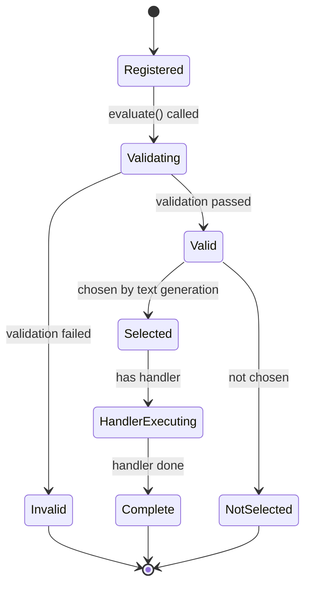
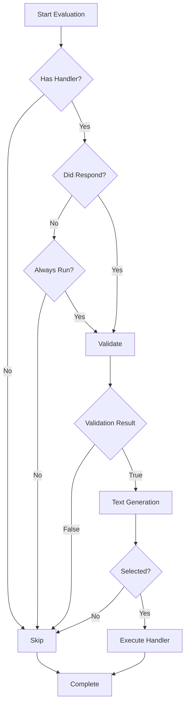
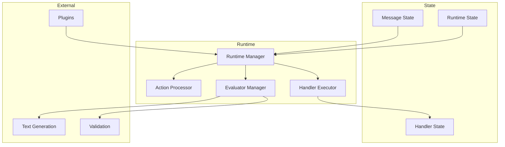
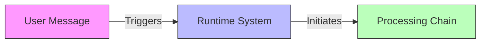
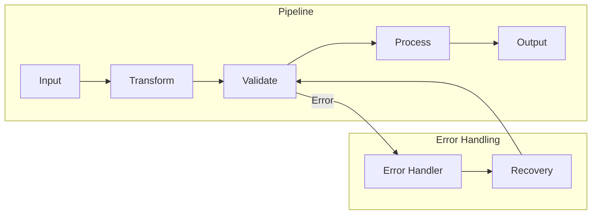

# Evaluator Handler Runtime Operation Analysis

## Disclaimer
This document was AI-generated by Cascade on 2025-01-02, based on analysis of the Eliza agent core source code from v.01.6-alpha5. While efforts have been made to ensure accuracy, this documentation may contain inaccuracies. Please use with discretion and refer to the original source code for definitive implementation details.

## Overview
This document provides a deep dive into the handler execution flow within the Eliza framework, specifically focusing on how and when evaluator handlers are called. This analysis reveals implementation details that are not covered in the official documentation.

## Handler Execution Flow

### 1. Evaluation Process
The evaluation process is managed by the `evaluate()` method in the `AgentRuntime` class. Here's the detailed sequence:

```typescript
async evaluate(message: Memory, state?: State, didRespond?: boolean, callback?: HandlerCallback)
```

### 2. Execution Stages

#### Stage 1: Parallel Validation
All evaluators are validated concurrently:
```typescript
const evaluatorPromises = this.evaluators.map(async (evaluator: Evaluator) => {
  elizaLogger.log("Evaluating", evaluator.name);
  if (!evaluator.handler || (!didRespond && !evaluator.alwaysRun)) {
    return null;
  }
  const result = await evaluator.validate(this, message, state);
  return result ? evaluator : null;
});
```

Key validation checks:
- Existence of handler function
- Response status (`didRespond`) or `alwaysRun` flag
- Evaluator's validate() method result

#### Stage 2: Resolution and Filtering
```typescript
const resolvedEvaluators = await Promise.all(evaluatorPromises);
const evaluatorsData = resolvedEvaluators.filter(Boolean);
```
- All validation promises are resolved
- Invalid/skipped evaluators are filtered out

#### Stage 3: Text Generation and Selection
```typescript
const context = composeContext({
  state: {
    ...state,
    evaluators: formatEvaluators(evaluatorsData),
    evaluatorNames: formatEvaluatorNames(evaluatorsData),
  },
  template: this.character.templates?.evaluationTemplate || evaluationTemplate,
});

const result = await generateText({
  runtime: this,
  context,
  modelClass: ModelClass.SMALL,
});

const evaluators = parseJsonArrayFromText(result) as string[];
```
- Context is composed with validated evaluators
- Text generation determines which evaluators to run
- Result is parsed to get final evaluator selection

#### Stage 4: Handler Execution
```typescript
for (const evaluator of this.evaluators) {
  if (!evaluators.includes(evaluator.name)) continue;
  if (evaluator.handler) {
    await evaluator.handler(this, message, state, {}, callback);
  }
}
```
- Handlers are called sequentially
- Only selected evaluators' handlers are executed
- Each handler receives runtime context, message, state, and callback

## Runtime Flow Diagrams

### 1. High-Level Handler Execution Flow


### 2. Evaluator State Machine


### 3. Parallel vs Sequential Operations

```mermaid
gantt
    title Handler Runtime Operations
    dateFormat X
    axisFormat %L

    section Actions
    Process Actions :a1, 0, 2m

    section Evaluators
    Parallel Validation :a2, after a1, 1m
    Text Generation :a3, after a2, 1m

    section Handlers
    Handler 1 :a4, after a3, 1m
    Handler 2 :a5, after a4, 1m
    Handler 3 :a6, after a5, 1m
```


### 4. Handler Decision Flow


### 5. Component Interaction


These diagrams illustrate:
1. The sequential flow of handler execution
2. State transitions during evaluation
3. Timing of parallel vs sequential operations
4. Decision tree for handler execution
5. Component interactions and data flow

## Understanding Real-Time Handler Operations: An Educational Guide

### 1. Core Concepts for Beginners

#### What is a Handler?
Think of a handler as a specialized worker in a factory. Just like a worker who handles specific tasks on an assembly line, a handler in software:
- Has a specific job to do
- Knows when to start its work
- Follows a defined process
- Reports when it's done

#### Parallel vs Sequential Operations
Imagine organizing a dinner party:
- **Parallel**: Multiple cooks preparing different dishes simultaneously
- **Sequential**: Following a recipe step by step, where each step must wait for the previous one

In our system:
- **Parallel**: Validating multiple evaluators at once
- **Sequential**: Executing handlers one after another

### 2. Real-Time System Concepts

#### State Management
Think of state like a scorecard in a game:
```
Initial State → Action Occurs → State Changes → New State
```

Example flow:
```typescript
// Initial state
state = { messageToSave: null }

// Action occurs
receiveMessage("Save this!")

// State changes
state = { messageToSave: "Previous message" }
```

#### Event-Driven Architecture
Like a restaurant kitchen:
1. Order comes in (Event)
2. Chef reads ticket (Handler triggered)
3. Food prepared (Processing)
4. Dish served (Completion)

### 3. Breaking Down the Runtime Flow

#### Stage 1: Message Reception


#### Stage 2: Validation (Parallel Processing)
```typescript
// Simplified example of parallel validation
async function validateAll(evaluators) {
    return Promise.all(evaluators.map(async (e) => {
        // All these run at the same time!
        return await e.validate();
    }));
}
```

Key Learning Points:
- Multiple validations happen simultaneously
- No validation waits for others
- All results collected at once

#### Stage 3: Handler Execution (Sequential Processing)
```typescript
// Simplified example of sequential execution
async function executeHandlers(handlers) {
    for (const handler of handlers) {
        // Each handler waits for the previous one
        await handler.execute();
    }
}
```

### 4. Real-World Analogies

#### The Restaurant Kitchen Model
| Kitchen Concept | Handler System Equivalent |
|-----------------|--------------------------|
| Order Ticket    | Message                  |
| Recipe Check    | Validation               |
| Cooking Steps   | Handler Execution        |
| Quality Check   | State Verification       |
| Serving         | Completion               |

#### The Assembly Line Model
| Assembly Line   | Handler System Equivalent |
|-----------------|--------------------------|
| Raw Materials   | Input Message            |
| Quality Control | Validation               |
| Work Stations   | Handlers                 |
| Checkpoints     | State Changes            |
| Final Product   | Completed Operation      |

### 5. Common Patterns and Their Uses

#### The Validation Pattern
```typescript
// Pattern for robust validation
async validate(runtime, message) {
    try {
        // 1. Check preconditions
        if (!message) return false;

        // 2. Verify state
        if (!runtime.isReady()) return false;

        // 3. Validate content
        return isValidContent(message);
    } catch (error) {
        // 4. Safe error handling
        return false;
    }
}
```

#### The Handler Pattern
```typescript
// Pattern for reliable handler execution
async handle(runtime, message, state) {
    // 1. State preparation
    const initialState = cloneState(state);

    try {
        // 2. Processing
        const result = await processMessage(message);

        // 3. State update
        updateState(state, result);

        // 4. Completion
        return success(result);
    } catch (error) {
        // 5. Rollback on failure
        restoreState(initialState);
        return failure(error);
    }
}
```

### 6. Performance Considerations

#### Response Time Management

```mermaid
gantt
    title Operation Timing
    dateFormat X
    axisFormat %L

    section Critical Path
    Validation    :crit, v1, 0, 2m
    Processing    :crit, p1, after v1, 2m

    section Optional
    Logging       :log1, after v1, 1m
    Analytics     :an1, after p1, 1m
```


Key Timing Factors:
1. **Validation Speed**: Keep validations light and fast
2. **Handler Duration**: Monitor and optimize long-running handlers
3. **Resource Usage**: Balance parallel operations based on system capacity

### 7. Debugging Tips for Real-Time Operations

#### Common Issues and Solutions
1. **Race Conditions**
   ```typescript
   // Bad
   let shared = {};
   handlers.forEach(h => h.modify(shared));

   // Good
   const results = await Promise.all(
       handlers.map(h => h.process())
   );
   const final = combineResults(results);
   ```

2. **State Management**
   ```typescript
   // Bad
   function updateState(newValue) {
       state = newValue;
   }

   // Good
   function updateState(newValue) {
       state = {
           ...state,
           ...newValue,
           lastUpdated: Date.now()
       };
   }
   ```

These concepts and patterns form the foundation of understanding real-time handler operations. By mastering these principles, developers can build more reliable and efficient systems.

## Execution Order Observations

1. **Action Handler First**
   - Action handlers complete before evaluation begins
   - This ensures all actions are processed before state evaluation

2. **Evaluations Second**
   - Evaluator validation runs in parallel
   - Results are collected and filtered

3. **Evaluator Handlers Last**
   - Handlers execute after all validation and selection
   - Run sequentially to maintain order and prevent race conditions

## Key Implementation Details

### Handler Execution Conditions
A handler will only be called if ALL of these conditions are met:
1. The evaluator has a handler function defined
2. Either:
   - `didRespond` is true (indicating a response was generated)
   - OR `evaluator.alwaysRun` is true
3. The evaluator's `validate()` method returns true
4. The evaluator's name appears in the generated text result

### Performance Considerations
- Parallel validation improves performance
- Sequential handler execution prevents race conditions
- Text generation acts as a final filter for handler execution

## Implications for Plugin Development

### Best Practices
1. Implement lightweight validation functions
   - They run in parallel
   - Should return quickly

2. Heavy processing should be in handlers
   - They run sequentially
   - Have guaranteed preconditions

3. Use `alwaysRun` flag judiciously
   - Affects when handler can be called
   - Impacts overall performance

### Handler Design Pattern
```typescript
const myEvaluator: Evaluator = {
  name: "my-evaluator",
  alwaysRun: false,
  validate: async (runtime, message, state) => {
    // Quick validation
    return shouldRun;
  },
  handler: async (runtime, message, state, options, callback) => {
    // Heavy processing
    // Guaranteed to have passed validation
  }
};
```

## Advanced Implementation Patterns

### 8. Advanced Implementation Patterns

#### A. The Observer Pattern in Real-Time Systems
```typescript
// Implementation of an event emitter for real-time updates
class HandlerEventEmitter {
    private listeners: Map<string, Function[]> = new Map();

    on(event: string, callback: Function) {
        if (!this.listeners.has(event)) {
            this.listeners.set(event, []);
        }
        this.listeners.get(event)?.push(callback);
    }

    emit(event: string, data: any) {
        this.listeners.get(event)?.forEach(callback => {
            try {
                callback(data);
            } catch (error) {
                console.error(`Error in ${event} listener:`, error);
            }
        });
    }
}

// Usage example
const handlerEvents = new HandlerEventEmitter();
handlerEvents.on('validation.complete', (results) => {
    console.log('Validation results:', results);
});
```

#### B. The Circuit Breaker Pattern
```typescript
class HandlerCircuitBreaker {
    private failures = 0;
    private lastFailure: number = 0;
    private readonly threshold = 5;
    private readonly resetTimeout = 60000; // 1 minute

    async execute(handler: () => Promise<any>) {
        if (this.isOpen()) {
            throw new Error('Circuit breaker is open');
        }

        try {
            const result = await handler();
            this.reset();
            return result;
        } catch (error) {
            this.recordFailure();
            throw error;
        }
    }

    private isOpen(): boolean {
        if (Date.now() - this.lastFailure > this.resetTimeout) {
            this.reset();
            return false;
        }
        return this.failures >= this.threshold;
    }

    private reset() {
        this.failures = 0;
        this.lastFailure = 0;
    }

    private recordFailure() {
        this.failures++;
        this.lastFailure = Date.now();
    }
}
```

### 9. Real-Time Data Flow Patterns

#### A. The Pipeline Pattern


```typescript
// Implementation of a pipeline pattern
class HandlerPipeline {
    private steps: Array<(data: any) => Promise<any>> = [];

    addStep(step: (data: any) => Promise<any>) {
        this.steps.push(step);
    }

    async execute(initialData: any) {
        let data = initialData;

        for (const step of this.steps) {
            try {
                data = await step(data);
            } catch (error) {
                await this.handleError(error, data);
                throw error;
            }
        }

        return data;
    }

    private async handleError(error: Error, data: any) {
        // Implement error recovery logic
        console.error('Pipeline error:', error);
        // Could implement retry logic, logging, or other recovery mechanisms
    }
}

// Usage example
const pipeline = new HandlerPipeline();
pipeline.addStep(async (data) => {
    // Transform step
    return { ...data, transformed: true };
});
pipeline.addStep(async (data) => {
    // Validation step
    if (!data.transformed) throw new Error('Invalid data');
    return data;
});
```

### 10. Testing Real-Time Handler Systems

#### A. Unit Testing Patterns
```typescript
// Example of a handler test suite
describe('Handler System Tests', () => {
    let handler: Handler;
    let mockRuntime: MockRuntime;

    beforeEach(() => {
        mockRuntime = new MockRuntime();
        handler = new Handler(mockRuntime);
    });

    test('should handle valid messages', async () => {
        const message = createTestMessage('valid');
        const result = await handler.process(message);
        expect(result.success).toBe(true);
    });

    test('should handle concurrent requests', async () => {
        const messages = Array(5).fill(null)
            .map(() => createTestMessage('valid'));

        const results = await Promise.all(
            messages.map(msg => handler.process(msg))
        );

        expect(results.every(r => r.success)).toBe(true);
    });
});
```

#### B. Load Testing Scenarios
```typescript
// Load test implementation
class HandlerLoadTest {
    private readonly concurrentUsers = 100;
    private readonly testDuration = 60000; // 1 minute

    async runTest(handler: Handler) {
        const startTime = Date.now();
        const metrics = {
            totalRequests: 0,
            successfulRequests: 0,
            failedRequests: 0,
            averageResponseTime: 0,
        };

        while (Date.now() - startTime < this.testDuration) {
            const promises = Array(this.concurrentUsers)
                .fill(null)
                .map(() => this.simulateRequest(handler, metrics));

            await Promise.all(promises);
        }

        return this.calculateResults(metrics);
    }

    private async simulateRequest(
        handler: Handler,
        metrics: any
    ) {
        const start = Date.now();
        try {
            await handler.process(createTestMessage('load-test'));
            metrics.successfulRequests++;
        } catch (error) {
            metrics.failedRequests++;
        }
        metrics.totalRequests++;
        metrics.averageResponseTime =
            (metrics.averageResponseTime * (metrics.totalRequests - 1) +
            (Date.now() - start)) / metrics.totalRequests;
    }
}
```

### 11. Monitoring and Observability

#### A. Metrics Collection
```typescript
class HandlerMetrics {
    private metrics: Map<string, number> = new Map();
    private timings: Map<string, number[]> = new Map();

    recordTiming(operation: string, duration: number) {
        if (!this.timings.has(operation)) {
            this.timings.set(operation, []);
        }
        this.timings.get(operation)?.push(duration);
    }

    incrementCounter(metric: string) {
        const current = this.metrics.get(metric) || 0;
        this.metrics.set(metric, current + 1);
    }

    getStats() {
        const stats: any = {};

        // Process counters
        for (const [metric, value] of this.metrics) {
            stats[metric] = value;
        }

        // Process timings
        for (const [operation, durations] of this.timings) {
            stats[`${operation}_avg`] = this.calculateAverage(durations);
            stats[`${operation}_p95`] = this.calculatePercentile(durations, 95);
        }

        return stats;
    }

    private calculateAverage(numbers: number[]): number {
        return numbers.reduce((a, b) => a + b, 0) / numbers.length;
    }

    private calculatePercentile(numbers: number[], percentile: number): number {
        const sorted = [...numbers].sort((a, b) => a - b);
        const index = Math.ceil((percentile / 100) * sorted.length) - 1;
        return sorted[index];
    }
}
```

#### B. Health Checks
```typescript
class HandlerHealthCheck {
    private readonly checks: Map<string, () => Promise<boolean>> = new Map();

    addCheck(name: string, check: () => Promise<boolean>) {
        this.checks.set(name, check);
    }

    async getHealth(): Promise<{
        status: 'healthy' | 'unhealthy',
        checks: Record<string, boolean>
    }> {
        const results: Record<string, boolean> = {};
        let allHealthy = true;

        for (const [name, check] of this.checks) {
            try {
                results[name] = await check();
                allHealthy = allHealthy && results[name];
            } catch (error) {
                results[name] = false;
                allHealthy = false;
            }
        }

        return {
            status: allHealthy ? 'healthy' : 'unhealthy',
            checks: results
        };
    }
}

// Usage example
const healthCheck = new HandlerHealthCheck();

healthCheck.addCheck('database', async () => {
    try {
        await runtime.databaseAdapter.ping();
        return true;
    } catch {
        return false;
    }
});

healthCheck.addCheck('messageQueue', async () => {
    return runtime.messageManager.isHealthy();
});
```

These advanced patterns and implementations provide a robust foundation for building reliable real-time handler systems. The examples cover:

1. Event handling with the Observer pattern
2. Circuit breaking for failure handling
3. Pipeline pattern for data flow
4. Comprehensive testing approaches
5. Monitoring and health check implementations

Each pattern is accompanied by practical code examples and explanations of their use cases.

## Conclusion
Understanding this execution flow is crucial for:
- Debugging handler behavior
- Optimizing evaluator performance
- Implementing correct plugin logic

This deep dive reveals the sophisticated orchestration of handlers in the Eliza framework, providing insights beyond the official documentation for advanced plugin development.
