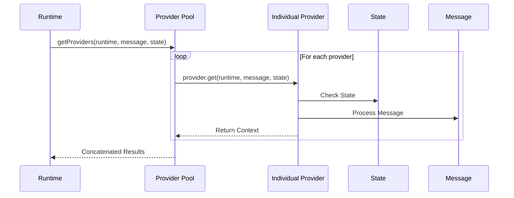
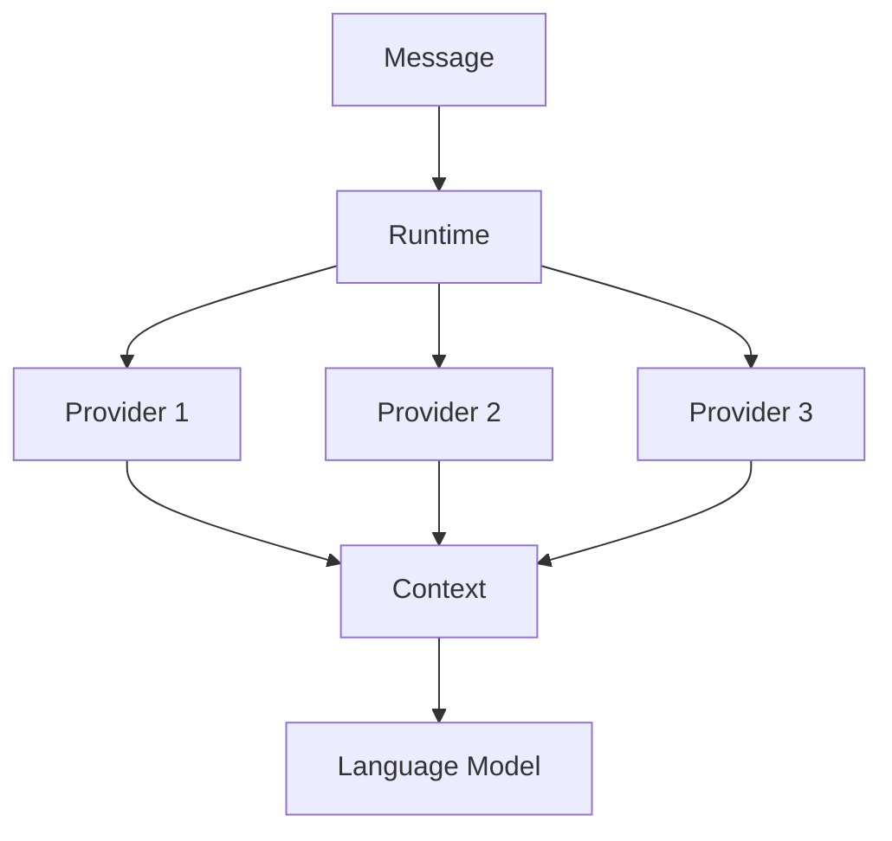
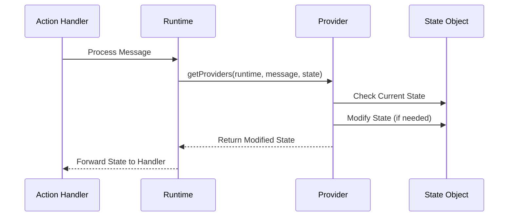

# Provider Runtime Operation

## Disclaimer
This document was AI-generated by Cascade on 2025-01-02, based on analysis of the Eliza agent core source code from v.01.6-alpha5. While efforts have been made to ensure accuracy, this documentation may contain inaccuracies. Please use with discretion and refer to the original source code for definitive implementation details.

## Overview

Providers are core components in Eliza that inject dynamic context and real-time information into agent interactions. They serve as a bridge between the agent and various external systems, enabling access to data, state management, and contextual information.

## Runtime Architecture



## Provider Lifecycle

### 1. Provider Registration

```typescript
// In plugin definition
const myPlugin: Plugin = {
    name: "my-plugin",
    providers: [myProvider],
    // ...other plugin properties
};
```

### 2. Runtime Integration

```typescript
// Core runtime provider handling
async function getProviders(
    runtime: IAgentRuntime,
    message: Memory,
    state?: State
) {
    const providerResults = await Promise.all(
        runtime.providers.map(async (provider) => {
            return await provider.get(runtime, message, state);
        })
    );

    return providerResults
        .filter(result => result != null && result !== "")
        .join("\n");
}
```

### 3. Provider Execution Flow

1. **Initialization**
   - Runtime loads registered providers
   - Each provider is initialized with runtime context

2. **Message Processing**
   - Runtime receives incoming message
   - Current state is gathered
   - Providers are called in parallel

3. **State Management**
   - Provider checks current state
   - Updates state if necessary
   - Returns modified state

4. **Context Generation**
   - Provider processes message and state
   - Generates contextual information
   - Returns formatted context string

## Provider Interface

```typescript
interface Provider {
    get: (
        runtime: IAgentRuntime,
        message: Memory,
        state?: State
    ) => Promise<any>;
}
```

### Key Components

1. **Runtime Access**
   - Full access to runtime services
   - Database operations
   - Message management
   - Cache control

2. **Message Context**
   - Current message details
   - User information
   - Room/conversation context
   - Content analysis

3. **State Management**
   - Current operation state
   - Historical context
   - Operation flags
   - Temporary data storage

## Provider Types

### 1. State Providers
```typescript
const stateProvider: Provider = {
    get: async (runtime, message, state) => {
        // Manage and return operation state
        return {
            ...state,
            operationStatus: "active",
            lastUpdate: Date.now()
        };
    }
};
```

### 2. Data Providers
```typescript
const dataProvider: Provider = {
    get: async (runtime, message, state) => {
        // Fetch and return external data
        const data = await runtime.database.query({
            table: "user_data",
            userId: message.userId
        });
        return formatData(data);
    }
};
```

### 3. Context Providers
```typescript
const contextProvider: Provider = {
    get: async (runtime, message, state) => {
        // Generate contextual information
        const context = await runtime.messageManager.getRecentContext(message);
        return processContext(context);
    }
};
```

## Best Practices

### 1. State Handling
- Always check state before modifications
- Return modified state consistently
- Handle null/undefined states gracefully

### 2. Error Management
```typescript
const robustProvider: Provider = {
    get: async (runtime, message, state) => {
        try {
            // Provider operations
            return result;
        } catch (error) {
            runtime.logger.error("Provider error", error);
            return state; // Return unchanged state on error
        }
    }
};
```

### 3. Performance Optimization
- Use caching when appropriate
- Implement rate limiting
- Handle async operations efficiently
- Filter out empty results

### 4. Context Formation
- Format data consistently
- Provide clear, structured output
- Handle missing data gracefully
- Maintain context relevance

## Runtime Considerations

1. **Parallel Execution**
   - Providers run concurrently
   - Results are aggregated
   - Empty results are filtered
   - Final context is concatenated

2. **State Consistency**
   - State updates are sequential
   - Last provider wins in conflicts
   - State is preserved across calls

3. **Error Handling**
   - Individual provider failures don't block others
   - System continues with available results
   - Errors are logged but not propagated

4. **Resource Management**
   - Providers should be lightweight
   - Heavy operations should be cached
   - Resources should be released properly

## Context Management

### Provider's Role in Context Generation

Providers are a crucial part of Eliza's context management system, enriching the conversation with dynamic, contextual information. They serve as a bridge between the agent's knowledge base and the ongoing conversation.



### Context Flow

1. **Context Generation**
   ```typescript
   // Provider implementation
   get: async (runtime: IAgentRuntime, message: Memory, state?: State) => {
       // Access runtime services
       const db = runtime.databaseAdapter;

       // Generate context based on message
       const relevantData = await db.query(...);

       // Return context string
       return `Relevant context: ${relevantData}`;
   }
   ```

2. **Context Aggregation**
   ```typescript
   // In runtime
   const context = await getProviders(runtime, message, state);
   // context = "Provider1Context\nProvider2Context\nProvider3Context"
   ```

### Available Context Data

1. **Runtime Context**
   - Database access via `runtime.databaseAdapter`
   - Memory management via `runtime.messageManager`
   - Service access via `runtime.getService()`
   - Cache access via `runtime.cacheManager`

2. **Message Context**
   ```typescript
   interface Memory {
       id: UUID;           // Message ID
       content: Content;   // Message content
       roomId: UUID;       // Conversation room
       userId?: UUID;      // Sender ID
       timestamp: Date;    // Creation time
       metadata?: any;     // Additional data
   }
   ```

3. **State Context**
   ```typescript
   interface State {
       userId?: UUID;
       agentId?: UUID;
       roomId: UUID;
       bio: string;
       lore: string;
       actors: string;
       actorsData?: Actor[];
       goals?: string;
       goalsData?: Goal[];
       recentMessages: string;
       recentMessagesData: Memory[];
   }
   ```

### Context Best Practices

1. **Efficient Context Generation**
   ```typescript
   const provider: Provider = {
       get: async (runtime, message, state) => {
           // 1. Cache expensive operations
           const cacheKey = `context_${message.id}`;
           const cached = await runtime.cacheManager.get(cacheKey);
           if (cached) return cached;

           // 2. Generate minimal relevant context
           const context = await generateContext(message);

           // 3. Cache for reuse
           await runtime.cacheManager.set(cacheKey, context);
           return context;
       }
   };
   ```

2. **Context Formatting**
   - Keep context concise and relevant
   - Use clear section headers
   - Format data consistently
   ```typescript
   return `
   RELEVANT_KNOWLEDGE:
   ${knowledge}

   USER_PREFERENCES:
   ${preferences}

   CONVERSATION_HISTORY:
   ${history}
   `;
   ```

3. **Context Priority**
   - Return `null` or empty string for irrelevant contexts
   - Order context by importance (most important first)
   - Limit context length based on token limits

4. **Error Handling**
   ```typescript
   get: async (runtime, message, state) => {
       try {
           const context = await generateContext(message);
           return context;
       } catch (error) {
           // Log error but don't fail
           console.error('Context generation failed:', error);
           return null;
       }
   }
   ```

### Advanced Context Features

1. **Dynamic Context Loading**
   ```typescript
   get: async (runtime, message, state) => {
       // Load context based on message content
       if (message.content.includes('weather')) {
           return await getWeatherContext(message);
       }
       if (message.content.includes('schedule')) {
           return await getScheduleContext(message);
       }
       return null;
   }
   ```

2. **Context Chaining**
   ```typescript
   get: async (runtime, message, state) => {
       // Build context chain
       const baseContext = await getBaseContext(message);
       const enhancedContext = await enhanceContext(baseContext);
       const finalContext = await formatContext(enhancedContext);
       return finalContext;
   }
   ```

3. **Stateful Context**
   ```typescript
   get: async (runtime, message, state) => {
       if (!state) return null;

       // Update state
       state.contextVersion = (state.contextVersion || 0) + 1;

       // Return both context and state
       return `Context Version: ${state.contextVersion}`;
   }
   ```

### Context Debugging

1. **Context Inspection**
   ```typescript
   get: async (runtime, message, state) => {
       const context = await generateContext(message);

       // Log context for debugging
       console.log('Generated context:', {
           length: context.length,
           sections: context.split('\n\n').length,
           preview: context.slice(0, 100)
       });

       return context;
   }
   ```

2. **Context Validation**
   ```typescript
   function validateContext(context: string): boolean {
       // Check context format
       if (!context.includes('RELEVANT_KNOWLEDGE:')) return false;

       // Check context length
       if (context.length > MAX_CONTEXT_LENGTH) return false;

       return true;
   }
   ```

## State Management Deep Dive

### State Flow in Runtime



### State Return Behavior

1. **Provider's Return Value**
   ```typescript
   // Provider implementation
   get: async (runtime: IAgentRuntime, message: Memory, state?: State) => {
       // Modifying state directly works because state is an object (passed by reference)
       if (state) {
           state.shouldSave = true;  // This modification persists
           return state;  // Returning state is optional if modified in place
       }
       return null;  // Can return null/undefined for no changes
   }
   ```

2. **Runtime's State Handling**
   ```typescript
   // In core runtime
   async function getProviders(
       runtime: IAgentRuntime,
       message: Memory,
       state?: State
   ) {
       const providerResults = await Promise.all(
           runtime.providers.map(async (provider) => {
               return await provider.get(runtime, message, state);
           })
       );

       // Note: Only provider context strings are concatenated
       // State modifications happen in-place
       return providerResults
           .filter(result => result != null && result !== "")
           .join("\n");
   }
   ```

### Key Points About State

1. **State Modification Methods**
   - **Direct Modification**: State is an object passed by reference, so changes made directly to the state object persist
   - **Return Value**: Provider can return the modified state, but this is optional if state was modified in place
   - **Context String**: Provider can return a string to be included in the context, separate from state management

2. **State Persistence**
   ```typescript
   const stateProvider: Provider = {
       get: async (runtime, message, state) => {
           if (state) {
               // Method 1: Direct modification (Recommended)
               state.someFlag = true;  // This persists

               // Method 2: Return new state (Not necessary if modified in place)
               return {
                   ...state,
                   someFlag: true
               };

               // Method 3: Return context string only
               return "Some context";  // State changes still persist from Method 1
           }
       }
   };
   ```

3. **Common Issues**
   - **Lost State Changes**: If you create a new state object without returning it, changes won't be visible to other components
   - **Undefined State**: Always check if state exists before modifying
   - **Context vs State**: Distinguish between returning context strings and modifying state

4. **Best Practices**
   ```typescript
   const robustStateProvider: Provider = {
       get: async (runtime, message, state) => {
           // 1. Always check state existence
           if (!state) return null;

           // 2. Modify state directly for changes
           state.someFlag = true;

           // 3. Return context string if needed
           return "Provider context";

           // State changes persist without explicit return
       }
   };
   ```

### Action Handler State Access

```typescript
const actionHandler: Handler = async (
    runtime: IAgentRuntime,
    message: Memory,
    state: State,
    options: any,
    callback?: HandlerCallback
) => {
    // State includes all provider modifications
    if (state.shouldSave) {
        // This flag will be available if set by provider
        // No special return handling needed
    }
};
```

### Runtime State Flow

1. **Initialization**
   - Runtime creates initial state object
   - State passed to providers during message processing

2. **Provider Phase**
   - Each provider receives same state object reference
   - Modifications are made directly to state
   - Context strings returned separately

3. **Action Phase**
   - Modified state passed to action handlers
   - All provider changes available in handler
   - State continues to be mutable

4. **State Lifetime**
   - State persists for duration of message processing
   - Cleared/reset for each new message
   - No automatic persistence between messages

This deep dive explains why your `shouldSave` flag modifications in the provider should work as long as:
1. You're modifying the state object directly
2. The state object exists when the modification is made
3. You're checking for the flag in the correct action handler context

If you're not seeing the flag in your action handler, verify:
1. The state object exists when provider runs
2. The modification is happening before the action handler executes
3. You're looking at the same state object instance

## Provider Implementation Template

```typescript
import { Provider, IAgentRuntime, Memory, State } from "@ai16z/eliza";

interface CustomState extends State {
    customData?: any;
}

const customProvider: Provider = {
    get: async (
        runtime: IAgentRuntime,
        message: Memory,
        state?: CustomState
    ) => {
        // 1. Log operation start
        runtime.logger.debug("Custom provider started", {
            messageId: message.id
        });

        try {
            // 2. Check/initialize state
            const currentState = state || {};

            // 3. Process message
            const processedData = await processMessage(message);

            // 4. Update state
            const newState = {
                ...currentState,
                customData: processedData
            };

            // 5. Generate context
            const context = formatContext(processedData);

            // 6. Return result
            return {
                state: newState,
                context: context
            };

        } catch (error) {
            // 7. Handle errors
            runtime.logger.error("Custom provider error", error);
            return state;
        }
    }
};
```

This document outlines the core operation of providers in the Eliza runtime system. Providers are essential for maintaining state, providing context, and integrating external data into the agent's operation flow.

## Appendix: Provider Case Studies

### Case Study 1: Knowledge Base Provider
A provider that retrieves relevant knowledge based on semantic similarity.

```typescript
interface KnowledgeProvider extends Provider {
    get: async (runtime: IAgentRuntime, message: Memory, state?: State) => {
        // 1. Extract query from message
        const query = message.content.text;

        // 2. Get embeddings for query using core embed function
        const embedding = await embed(runtime, query);

        // 3. Search knowledge base using memory manager
        const results = await runtime.knowledgeManager.searchMemoriesByEmbedding(
            embedding,
            {
                match_threshold: 0.7,
                count: 3,
                roomId: message.roomId,
                unique: true
            }
        );

        // 4. Format results
        if (!results.length) return null;

        return `
        RELEVANT_KNOWLEDGE:
        ${results.map(r => `- ${r.content.text}`).join('\n')}
        `;
    }
}

// Usage:
const runtime = new AgentRuntime({
    providers: [new KnowledgeProvider()],
    // ... other config
});
```

### Case Study 2: User Preference Provider
Maintains and provides user preferences across conversations.

```typescript
interface UserPreferences {
    language: string;
    timezone: string;
    notificationPrefs: string[];
}

class PreferenceProvider implements Provider {
    private cache: Map<string, UserPreferences> = new Map();

    async get(runtime: IAgentRuntime, message: Memory, state?: State) {
        if (!state?.userId) return null;

        // 1. Check cache first
        let prefs = this.cache.get(state.userId);

        if (!prefs) {
            // 2. Load from database
            const results = await runtime.databaseAdapter.query(
                'SELECT preferences FROM users WHERE id = ?',
                [state.userId]
            );

            if (results.length) {
                prefs = results[0].preferences;
                this.cache.set(state.userId, prefs);
            }
        }

        // 3. Return formatted preferences
        if (!prefs) return null;

        return `
        USER_PREFERENCES:
        Language: ${prefs.language}
        Timezone: ${prefs.timezone}
        Notifications: ${prefs.notificationPrefs.join(', ')}
        `;
    }
}
```

### Case Study 3: Conversation Memory Provider
Provides relevant historical conversations based on current context.

```typescript
class ConversationMemoryProvider implements Provider {
    async get(runtime: IAgentRuntime, message: Memory, state?: State) {
        if (!state?.roomId) return null;

        // 1. Get recent messages
        const recentMessages = await runtime.messageManager.getMessages({
            roomId: state.roomId,
            limit: 10,
            order: 'DESC'
        });

        // 2. Find relevant older messages
        const olderMessages = await this.findRelevantHistory(
            runtime,
            message,
            state.roomId
        );

        // 3. Combine and format
        return this.formatConversationContext(
            recentMessages,
            olderMessages
        );
    }

    private async findRelevantHistory(
        runtime: IAgentRuntime,
        currentMessage: Memory,
        roomId: string
    ) {
        // Get embedding for current message
        const embedding = await embed(runtime, currentMessage.content.text);

        // Search message history
        return runtime.messageManager.searchMemoriesByEmbedding(
            embedding,
            {
                match_threshold: 0.8,
                count: 5,
                roomId,
                unique: true
            }
        );
    }

    private formatConversationContext(
        recent: Memory[],
        historical: Memory[]
    ): string {
        return `
        RECENT_CONVERSATION:
        ${this.formatMessages(recent)}

        RELEVANT_HISTORY:
        ${this.formatMessages(historical)}
        `;
    }

    private formatMessages(messages: Memory[]): string {
        return messages
            .map(m => `${m.userId}: ${m.content.text}`)
            .join('\n');
    }
}
```

### Case Study 4: External API Provider
Integrates real-time data from external APIs.

```typescript
interface WeatherData {
    temperature: number;
    condition: string;
    forecast: string[];
}

class WeatherProvider implements Provider {
    private readonly API_KEY: string;
    private readonly CACHE_TTL = 1800000; // 30 minutes

    constructor(apiKey: string) {
        this.API_KEY = apiKey;
    }

    async get(runtime: IAgentRuntime, message: Memory, state?: State) {
        // 1. Check if weather info is needed
        if (!this.isWeatherRelevant(message.content.text)) {
            return null;
        }

        // 2. Get user's location from state
        const location = await this.getUserLocation(runtime, state);
        if (!location) return null;

        // 3. Check cache
        const cacheKey = `weather_${location}`;
        const cached = await runtime.cacheManager.get(cacheKey);
        if (cached) return cached;

        // 4. Fetch weather data
        try {
            const weather = await this.fetchWeatherData(location);

            // 5. Format response
            const context = this.formatWeatherContext(weather);

            // 6. Cache result
            await runtime.cacheManager.set(
                cacheKey,
                context,
                this.CACHE_TTL
            );

            return context;
        } catch (error) {
            console.error('Weather API error:', error);
            return null;
        }
    }

    private isWeatherRelevant(text: string): boolean {
        const weatherKeywords = [
            'weather', 'temperature', 'forecast',
            'rain', 'sunny', 'cold', 'hot'
        ];
        return weatherKeywords.some(kw =>
            text.toLowerCase().includes(kw)
        );
    }

    private async fetchWeatherData(
        location: string
    ): Promise<WeatherData> {
        const response = await fetch(
            `https://api.weather.com/v1/forecast?` +
            `location=${encodeURIComponent(location)}` +
            `&apikey=${this.API_KEY}`
        );
        return response.json();
    }

    private formatWeatherContext(weather: WeatherData): string {
        return `
        WEATHER_INFORMATION:
        Current Temperature: ${weather.temperature}°C
        Condition: ${weather.condition}

        3-Day Forecast:
        ${weather.forecast.join('\n')}
        `;
    }
}
```

### Case Study 5: Stateful Task Provider
Manages and provides context about ongoing tasks or conversations.

```typescript
interface TaskState {
    currentStep: number;
    totalSteps: number;
    taskType: string;
    startTime: Date;
}

class TaskProvider implements Provider {
    async get(runtime: IAgentRuntime, message: Memory, state?: State) {
        if (!state) return null;

        // 1. Get or initialize task state
        let taskState = state.taskState as TaskState;
        if (!taskState && this.isTaskInitiation(message)) {
            taskState = await this.initializeTask(message);
            state.taskState = taskState;
        }

        if (!taskState) return null;

        // 2. Update task state based on message
        taskState = await this.updateTaskState(
            taskState,
            message
        );
        state.taskState = taskState;

        // 3. Generate task context
        return this.generateTaskContext(taskState);
    }

    private isTaskInitiation(message: Memory): boolean {
        const initiationPhrases = [
            'let\'s start',
            'begin task',
            'new task'
        ];
        return initiationPhrases.some(phrase =>
            message.content.text.toLowerCase().includes(phrase)
        );
    }

    private async initializeTask(
        message: Memory
    ): Promise<TaskState> {
        return {
            currentStep: 1,
            totalSteps: await this.analyzeTotalSteps(message),
            taskType: await this.determineTaskType(message),
            startTime: new Date()
        };
    }

    generateTaskContext(task: TaskState): string {
        const duration = Date.now() - task.startTime.getTime();

        return `
        CURRENT_TASK_STATUS:
        Type: ${task.taskType}
        Progress: Step ${task.currentStep} of ${task.totalSteps}
        Duration: ${Math.floor(duration / 1000)}s

        TASK_CONTEXT:
        ${this.getStepSpecificContext(task)}
        `;
    }
}
```

These case studies demonstrate:
1. Integration with runtime services
2. Efficient caching strategies
3. State management
4. Error handling
5. External API integration
6. Context formatting
7. Real-world implementation patterns

Each example shows a different aspect of provider implementation and can be used as a template for similar use cases.
